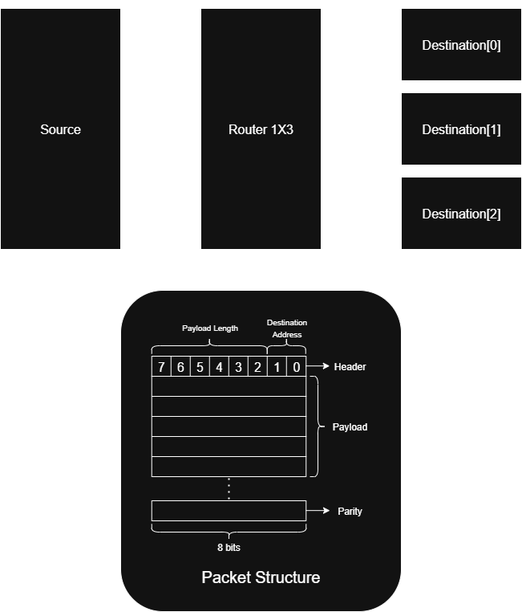
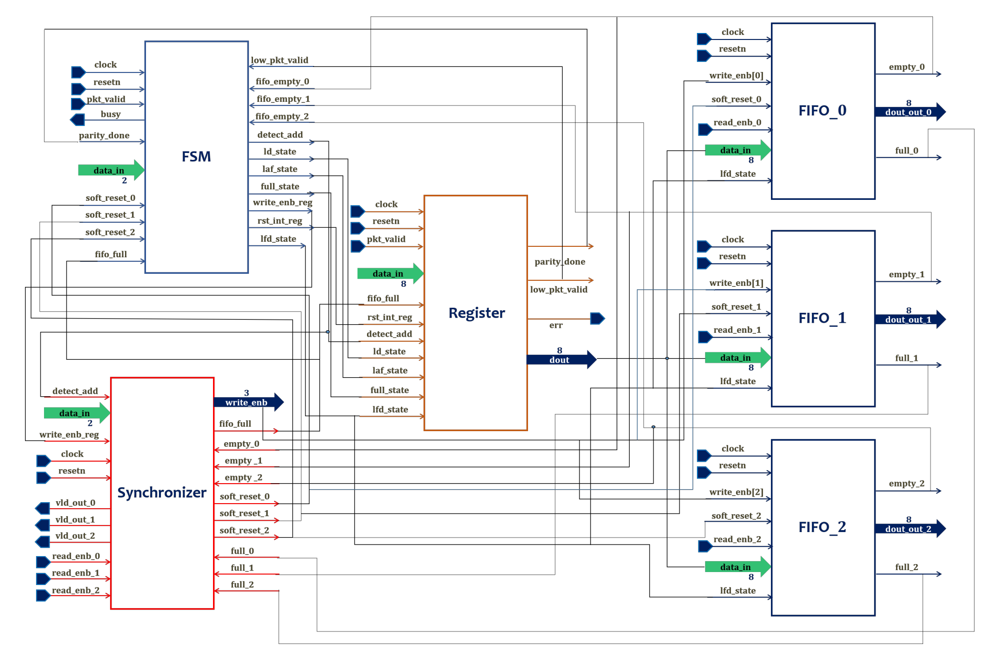
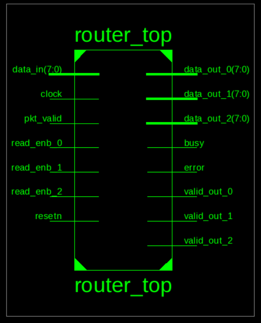
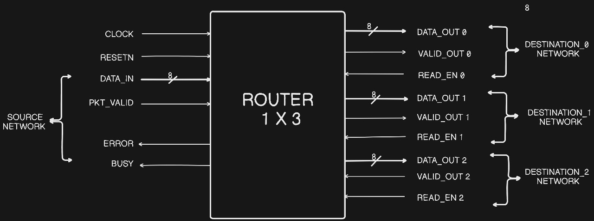
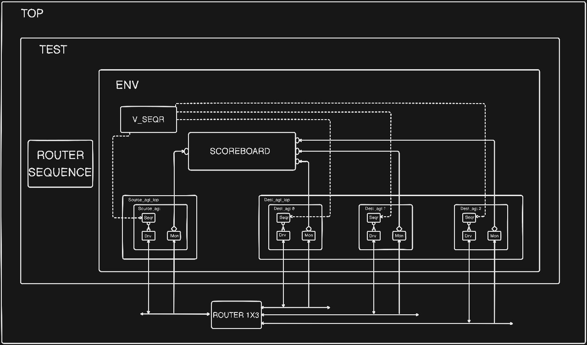

```markdown
# Router 1x3 Project

This repository contains the RTL design and UVM verification 
environment for a 1x3 Router project.
The router is designed to route packets from a single
input port to three output ports based on the header information.
```
---
## 🧱 Block-Level RTL Design

The RTL is structured into **6 modules**:

### 1️⃣ FSM Controller

- Central controller driving states based on inputs.
- Generates synchronization, register, and FIFO control signals.

### 2️⃣ Synchronizer

- Decodes header to determine destination FIFO.
- Generates **write enable** for FIFOs.
- Controls **valid_out** signals to destinations.
- Performs **soft reset** if FIFO data isn’t read in 30 cycles.

### 3️⃣ Register Block

- Holds header, parity, and intermediate states.
- Computes internal parity for error checking.

### 4️⃣ FIFO Buffers (x3)

- One FIFO per destination.
- Stores payload data and outputs on valid read.

### 5️⃣ Router Top

- Integrates FSM, Synchronizer, Register, and FIFOs.

📌 **Diagram:**



---


---


------

## 📦 Packet Structure

```
+-------------+-------------------+---------------+
| Header Byte | Payload (n Bytes) | Parity Byte   |
+-------------+-------------------+---------------+
|                   PYALOAD 0                      |
+-------------+-------------------+---------------+
|                       |                         |
+-------------+-------------------+---------------+
|                       |                         |
+-------------+-------------------+---------------+
|                       |                         |
+-------------+-------------------+---------------+
|                  PYALOAD 63                     |
+-------------+-------------------+---------------+
```

- **Header Byte**:
  - Bits [7:2] → Payload length (max 64 bytes)
  - Bits [1:0] → Destination address
- **Payload**: Actual data bytes [63:0].
- **Parity**: Single-byte  error detection.

## Project Overview

The Router 1x3 is a digital design that:
- Routes packets from one input port to three output ports
- Uses FIFOs for output buffering (16x9 bits each)
- Implements parity checking for error detection
- Features a FSM-based control system

---

## Architecture

### RTL Block Diagram


### UVM Testbench Architecture


---

## Key Features

### Input Protocol
- Active low signals (except reset)
- Header byte contains routing address
- Packet validation and parity checking
- Busy signal handling for flow control

### Output Protocol
- Three independent output ports (data_out_0, data_out_1, data_out_2)
- Valid signal indication for each port
- 16x9 FIFO buffering per output
- 30-cycle timeout mechanism

### FIFO Features
- 16 bytes depth with 9-bit width
- Header byte detection (9th bit)
- Synchronous reset support
- Overflow and underflow protection
- Simultaneous read/write capability

---

## Directory Structure

```
├── dest/                   # Destination Components
│   ├── dest_agent.sv
│   ├── dest_agent_top.sv
│   ├── dest_config.sv
│   ├── dest_drv.sv
│   ├── dest_mon.sv
│   ├── dest_seqs.sv
│   ├── dest_sequencer.sv
│   └── dest_trans.sv
├── env/                    # Environment Components
│   ├── env_config.sv
│   ├── env.sv
│   ├── scoreboard.sv
│   ├── virtual_seqs.sv
│   └── virtual_sequencer.sv
├── rtl/                    # RTL Design Files
│   ├── dest_if.sv
│   ├── fifo.v
│   ├── fsm.v
│   ├── register.v
│   ├── router_top.v
│   ├── source_if.sv
│   └── synchronizer.v
├── source/                 # Source Components
│   ├── source_agent.sv
│   ├── source_agent_top.sv
│   ├── source_config.sv
│   ├── source_drv.sv
│   ├── source_mon.sv
│   ├── source_seqs.sv
│   ├── source_sequencer.sv
│   └── source_trans.sv
├── test/                   # Test Cases
│   └── base_test.sv
├── top/                    # Top level Files 
│   ├── router_pkg.sv
│   └── top.sv
└── report/                 # Report 
    └── index.html
```

## RTL Components

1. **Router Top**: Main module integrating all submodules
2. **FSM**: Controls packet routing and state management
3. **FIFO**: Implements 16x9 output buffers
4. **Synchronizer**: Handles communication between FSM and FIFOs
5. **Register**: Implements internal registers for data handling

## UVM Testbench Components

1. **Source Agent**: Handles input port stimulus
2. **Destination Agent**: Monitors output ports
3. **Environment**: Contains scoreboard and virtual sequencer
4. **Sequences**: Various test scenarios
5. **Scoreboard**: Validates router functionality

## Simulation and Verification

### Running Tests
```bash
cd sim
make clean
make regress # for running all the test cases
```

### Coverage Reports
Coverage reports are available in the `report/` directory:
- Assertion Coverage

## FSM States

1. DECODE_ADDRESS: Initial packet processing
2. LOAD_FIRST_DATA: Header byte handling
3. LOAD_DATA: Payload processing
4. LOAD_PARITY: Parity byte handling
5. FIFO_FULL_STATE: Overflow protection
6. LOAD_AFTER_FULL: Post-full state handling
7. WAIT_TILL_EMPTY: FIFO empty wait
8. CHECK_PARITY_ERROR: Error detection

---


